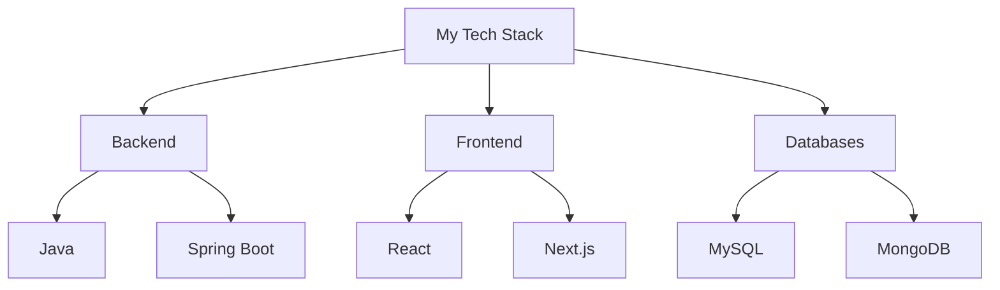

# 👋 Hello, I'm Nayeem Ahmad Dar

## 👨‍💻 Full Stack Developer | Java Spring Boot | React & Next.js Expert

  
  
  
  
  
  
  

---

### 🚀 About Me

- 🎓 BE in Computer Science from Govt College of Engineering and Technology, Jammu (2017-2021)
- 💼 2 years of experience in full-stack development
- 🌟 Passionate about creating efficient and scalable web applications

---

### 💻 Tech Stack

---

---

---

### 🤝 Let's Connect

  
  
  
  

---

  <i>⭐️ From [Your Name] (https://github.com/Nayeemdar)</i>

